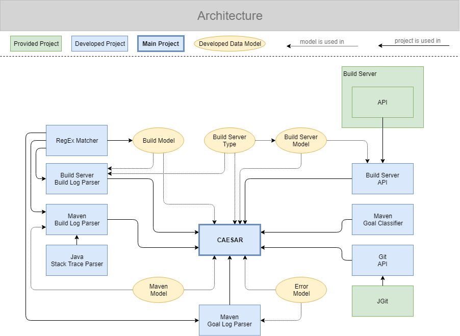

**Command Line Interface** |
_[IntelliJ Plugin](https://github.com/alexscheitlin/build-failure-resolution-assistant-intellij-plugin)_

# Build Failure Resolution Assistant

_Helps fixing broken builds by downloading and summarizing build logs._

The Build Failure Resolution Assistant connects to a build server and shows all executed builds to the user. By selecting one of the builds the corresponding build log is downloaded, parsed, and summarized. The user then gets a summary of the build's execution like information about it's status (successful or not) or possible errors. Every failed build gets classified (e.g. dependency, compilation, or test issues) and occurred errors are listed with information about their location (file and line/column). If the user decides to fix the build failure, uncommitted changes get saved automatically and the code base causing the build failure is downloaded and checked out. The user may now debug and fix the errors, merge the applied changes to whatever branch he wants, push the changes to the remote repository the build server monitors, reapply the previously saved changes, and continue working where he stopped.

Currently the BFRA supports projects developed with Git and Maven using TeamCity as a build server. Although the classification of build failures works for numerous types of errors, the error detection and localization is only implemented for basic errors concerning dependency issues, compilation errors, and failing tests.

## Modules

This project contains the following modules:

- [Build Server Type](build-server-type)
- [Build Server Model](build-server-model)
- [Team City Build Model](teamcity-build-model)
- [Maven Model](maven-model)
- [Error Model](error-model)
- [Build Server API](build-server-api)
- [Git API](git-api)
- [Build Server Build Log Parser](build-server-build-log-parser)
- [Maven Build Log Parser](maven-build-log-parser)
- [Maven Goal Log Parser](maven-goal-log-parser)
- [Maven Goal Classifier](maven-goal-classifier)
- [Build Failure Resolution Assistant](build-failure-resolution-assistant)

## Architecture

The following visualization shows how the different modules interact. A more detailed overview on how the Build Failure Resolution Assistant operates is given [here](build-failure-resolution-assistant).

