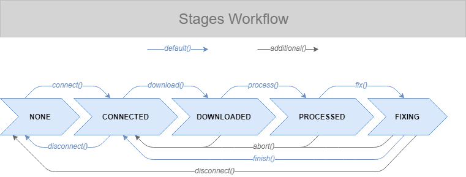

# Build Failure Resolution Assistant

> _Helps fixing build failures by downloading a build log, parsing and summarizing it, reporting its status and possible errors, stashing open local changes, checking out the failed version, providing hints on where possible errors happened, let the user fix the error, and reapplies previously stashed changes._

## Stages

A assistance instance is always in one of the following stages:

- `NONE`: a new instance is created but no further action was taken
- `CONNECTED`: connected to the build server
- `DOWNLOADED`: a build log is downloaded but not processed
- `PROCESSED`: the previously downloaded build log is parsed and summarized
- `FIXING`: the user is fixing a possible error

For entering one of the stages, the following methods are used:

- `connect()` -> `CONNECTED`
- `download()` -> `DOWNLOADED`
- `process()` -> `PROCESSED`
- `fix()` -> `FIXING`
- `finish()` -> `CONNECTED`
- `disconnect()` -> `NONE`
- `abort()` -> `CONNECTED`

Note: The stages may only be executed in the given order and no stage may be left out.

