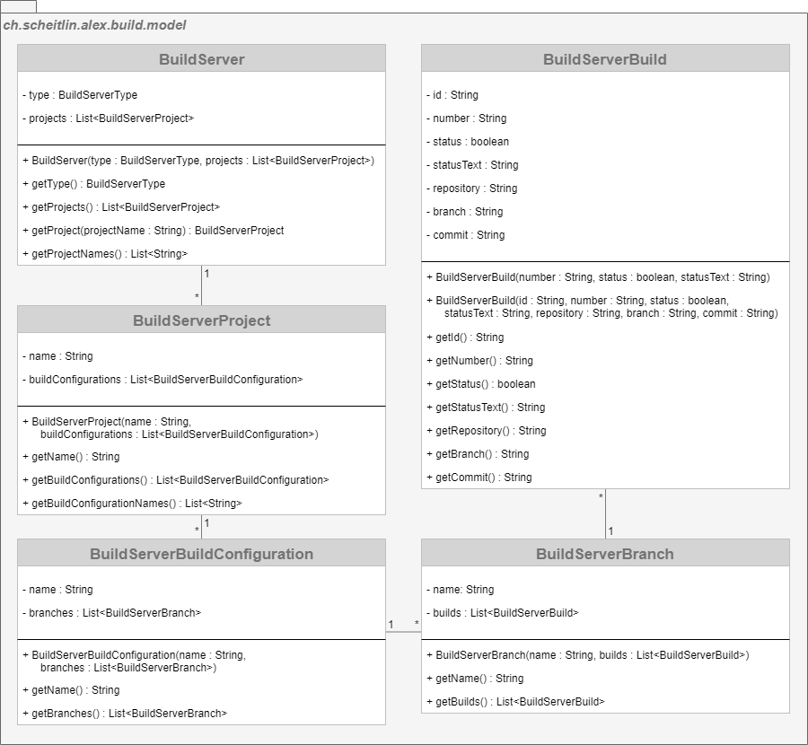

# Build Server Model

> _Represents the data of a build server._

A `BuildServer` has a `BuildServerName` (currently only TeamCity is supported) and multiple `Project`s.
Every `Project` has multiple `BuildConfiguration`s that execute `Build`s which may be grouped by the branch of the version control system.

# UML Class Diagram

