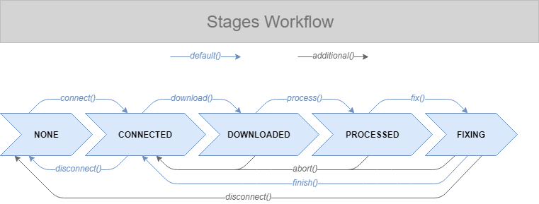
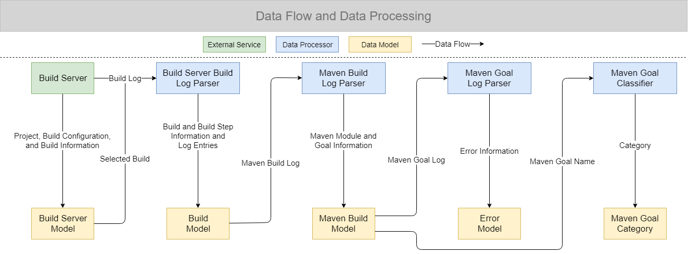

# CAESAR

> _Assists in fixing build failures by downloading a build log, parsing and summarizing it, reporting its status and possible errors, stashing open local changes, checking out the failed version, providing hints on where possible errors happened, and let the user fix the error._

## Stages

A CAESAR instance is always in one of the following stages:

- `NONE`: a new instance is created but no further action was taken
- `CONNECTED`: connected to the build server
- `DOWNLOADED`: a build log is downloaded but not processed
- `PROCESSED`: the previously downloaded build log is parsed and summarized
- `FIXING`: the user is fixing a possible error

For entering one of the stages, the following methods are used:

When trying to enter a new stage CAESAR starts doing the respective work and only enters the new stage if the work could be finished successfully. Once a new stage is entered CAESAR provides access to the computed results. The following list shows which data is computed before entering the respective stage:

- **CONNECTED**
  - build server model ([BuildServerModel](../build-server-model)): contains all the data about configured projects, build configurations, and executed builds on the build server
- **DOWNLOADED**
  - build server build log: the unprocessed build log as a `String`
- **PROCESSED**
  - maven build log: the maven log extracted from the build server build log as a `String`
  - maven build ([MavenModel](../maven-model)): contains all the data from the maven build log to explore it
  - failure category: one of the [13 failure categories](../maven-goal-classifier) if the build failed
  - errors: a list of occurred errors that caused a possible build failure
- **FIXING**
  - git repository url: the url specified as remote repository in the local git repository
  - stashed changes: the name of the stash if any changes were stashed before checking out the code base that caused the build failure
  - new branch: the name of the new branch (at the commit that caused the build failure)

_The data is only available when going to the next stage in the workflow. If `finish()`, `abort()`, or `disconnect()` are called, the data gets erased._

## Data Flow and Data Processing

The following visualization illustrates how data is passed between the different components of CAESAR and which component is responsible for which computations.

