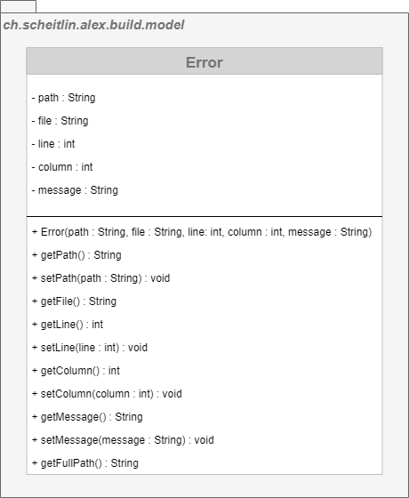

# Error Model

> _Represents an error occurred in a particular file.._

An `Error` holds information about the location of the file and possibly the location within the file where the error occurred. Additionally, an error message is given describing the error.

