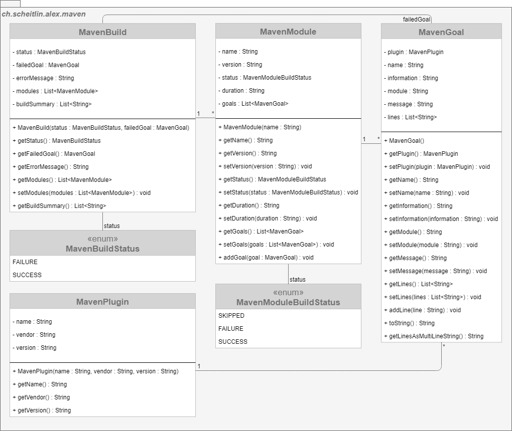

# Maven Model

> _Represents the data of a Maven build._

A `MavenBuild` consists of at least one `MavenModule` which has at least one `MavenGoal`. The log for every executed goal is stored within the a `MavenGoal`.

# UML Class Diagram

