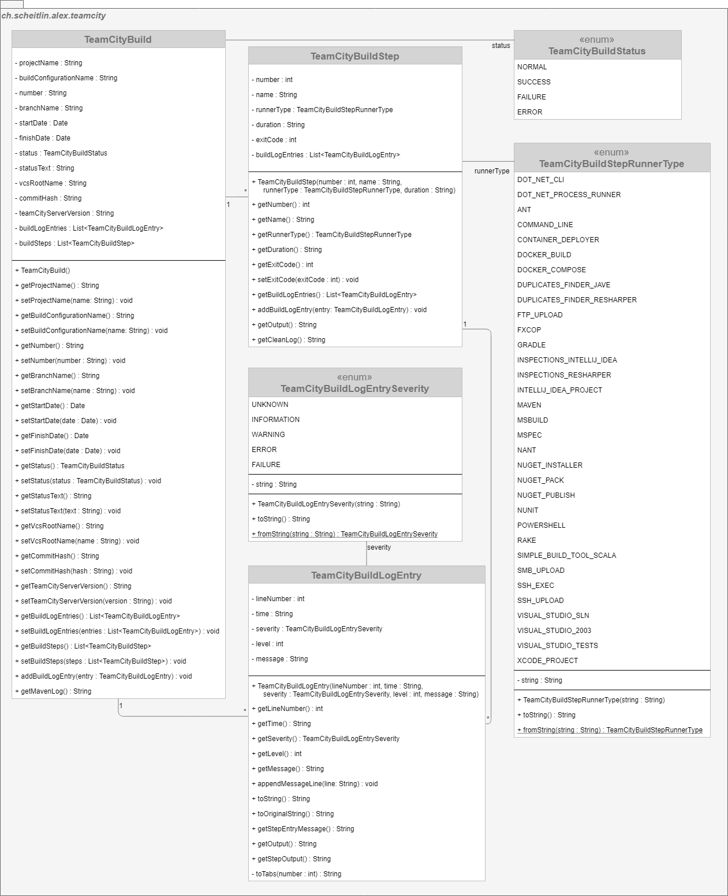

# TeamCity Build Model

> _Represents the data of a build on TeamCity._

A `TeamCityBuild` may be derived from a TeamCity build log. Besides information about the build (like the name of the project, the build number, and the status) a TeamCity build log holds information about every build step. Every line of a build log may be stored as a `TeamCityBuildLogEntry` both directly as a log entry of the `TeamCityBuld` but also as a log entry of a `TeamCityBuildStep`. However lines not belonging to a certain build step are only stored once.

# UML Class Diagram

